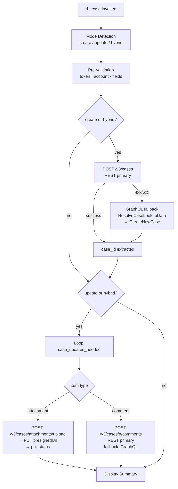

# rh_case

An Ansible role for creating and updating Red Hat Support Cases via the API.

## Description

This unified role provides comprehensive support case management capabilities, combining the functionality of creating new cases and updating existing ones. The role automatically detects the operation mode based on the provided variables:

- **Create Mode**: Creates a new Red Hat Support Case
- **Update Mode**: Updates an existing case with attachments and/or comments
- **Hybrid Mode**: Creates a new case and immediately updates it with attachments/comments

### Key Features

- **Automated case creation** – Creates support cases via the Red Hat Support API
- **Case ID retrieval** – Returns the newly created case ID for use in subsequent tasks
- **File uploads** – Uploads files via presigned URL (v3 REST API)
- **Comment support** – Adds comments in `plaintext` format
- **Batch operations** – Process multiple attachments and comments in a single run
- **Template-based comments** – Supports Jinja2 templates for customizable initial case comments
- **Account validation** – Retrieves and validates account information from the API token
- **Unified interface** – Single role for all case operations

## Requirements

- **On Control Node (Execution Host):**
  - Network access to the **Red Hat API endpoint** (`https://api.access.redhat.com`)
  - A valid Red Hat API access token (provided by the `rh_token_refresh` role)
  - `curl`: Only required when using the `rh_case_manager.py` CLI helper (not needed for the Ansible role itself)

## Operation Modes

The role automatically determines the operation mode based on the variables provided:

### Create Mode
Triggered when:
- `case_id` is NOT defined (or empty)
- Case creation fields are provided (`case_summary`, `case_product`, etc.)

**Required Variables:**
- `case_summary`
- `case_product`
- `case_description`
- `case_product_version`
- `case_type`
- `case_severity`

### Update Mode
Triggered when:
- `case_id` IS defined
- `case_updates_needed` is provided

**Required Variables:**
- `case_id`
- `case_updates_needed` (list)

### Hybrid Mode
Triggered when:
- `case_id` is NOT defined (or empty)
- Case creation fields are provided
- `case_updates_needed` is provided

**Required Variables:**
- All create mode variables
- `case_updates_needed` (list)

## Role Variables

### Input Variables

#### Authentication (Required)
| Variable | Description | Type | Required | Default |
|----------|-------------|------|----------|---------|
| `rh_token_refresh_api_access_token` | A valid, current Red Hat API access token. Typically provided as a fact by the `rh_token_refresh` role. | `string` | Yes | Supplied as fact |

#### Case Creation Variables (Required for Create/Hybrid Mode)
| Variable | Description | Type | Required | Default |
|----------|-------------|------|----------|---------|
| `case_summary` | The mandatory title/summary for the new support case. | `string` | Yes* | — |
| `case_description` | The detailed description of the issue. | `string` | Yes* | — |
| `case_product` | The exact, valid name of the Red Hat product (e.g., `"OpenShift Container Platform"`). | `string` | Yes* | — |
| `case_product_version` | The normalized base version string for the product (e.g., `"4.16"` for OpenShift, `"8.9"` for RHEL). | `string` | Yes* | — |
| `case_type` | The mandatory type of issue (e.g., `"Configuration Issue"`). | `string` | Yes* | — |
| `case_severity` | The severity level (e.g., `"3 (Normal)"`). | `string` | Yes* | — |
| `cluster_id` | Optional cluster ID to associate with the case (for OpenShift). | `string` | No | — |

\* Required for create/hybrid mode only

#### Case Update Variables (Required for Update/Hybrid Mode)
| Variable | Description | Type | Required | Default |
|----------|-------------|------|----------|---------|
| `case_id` | The Red Hat Support Case number (e.g., `01234567`). | `string` | Yes* | — |
| `case_updates_needed` | A list of objects defining attachments to upload or comments to add. | `list` | Yes* | — |

\* Required for update/hybrid mode only

#### `case_updates_needed` Object Structure

Each item in the `case_updates_needed` list can contain:

| Field | Description | Type | Required |
|-------|-------------|------|----------|
| `attachment` | Full path to the local file to upload. | `string` | No* |
| `attachmentDescription` | Description for the file being attached. | `string` | No |
| `comment` | Text of the comment to add to the case. | `string` | No* |
| `commentType` | Format of the comment: `plaintext`. The v3 API uses plaintext for all comments. | `string` | No |

> **\*** Each object must contain either `attachment` or `comment` (or both).

### Output Variables

| Variable | Description | Type |
|----------|-------------|------|
| `new_case_id` | The ID of the newly created support case (e.g., `00000000`). Set as a global fact for subsequent roles. | `string` |
| `case_id` | Set to `new_case_id` after case creation, or uses provided `case_id` for updates. | `string` |
| `account_name` | The name of the organization associated with the API token. | `string` |
| `accountNumberRef` | The numeric account ID required for API submission. | `string` |

### Advanced Configuration Variables

| Variable | Description | Type | Required | Default |
|----------|-------------|------|----------|---------|
| `rh_case_api_v3_base_url` | REST v3 API base URL for case creation, comments, and attachments. | `string` | No | `https://api.access.redhat.com` |
| `rh_case_graphql_url` | GraphQL fallback endpoint, used when REST v3 returns 4xx/5xx. | `string` | No | `https://graphql.redhat.com` |
| `rh_case_attachment_client_id` | Client identifier sent with v3 attachment upload requests. Required by the v3 attachment API. | `string` | No | `infra-support-assist` |
| `rh_case_attachment_poll_retries` | Number of status-poll attempts after a v3 attachment PUT. Each attempt waits `rh_case_attachment_poll_delay` seconds. Raise for files close to 5 GB. | `int` | No | `30` |
| `rh_case_attachment_poll_delay` | Seconds between each v3 attachment status-poll attempt. | `int` | No | `10` |
| `rh_case_http_proxy` | HTTP/HTTPS proxy URL for API requests (e.g., `http://proxy.example.com:8080`). | `string` | No | `""` |
| `rh_case_use_proxy` | Whether to use proxy for this role (falls back to `use_proxy`). | `bool` | No | `false` |
| `rh_case_no_log` | Suppress sensitive output in logs. | `bool` | No | `true` |
| `rh_case_timeout` | Timeout in seconds for file upload operations. | `int` | No | `1800` (30 min) |
| `rh_case_post_create_comment` | Whether to post initial comment after case creation. | `bool` | No | `true` |

## Dependencies

- This role **must** be run after `infra.support_assist.rh_token_refresh` to populate the required `rh_token_refresh_api_access_token` fact.

## Valid Input Options

For the fields **`case_product`**, **`case_type`**, and **`case_severity`**, the acceptable values must exactly match the Red Hat Support API's lookup tables.

Please consult the dedicated documentation file for the full list of valid options:

**[Full Case Option Lists: `docs/CASE_OPTIONS.md`](docs/CASE_OPTIONS.md)**

## Example Playbooks

### Example 1: Create a Support Case (Create Mode)

```yaml
---
- name: Create New Red Hat Support Case
  hosts: localhost
  connection: local
  gather_facts: false

  vars:
    # --- REQUIRED AUTHENTICATION INPUTS ---
    redhat_offline_token: "YOUR_OFFLINE_TOKEN_HERE"  # Use Ansible Vault!

    # --- REQUIRED CASE INPUTS ---
    case_summary: "Example Support Case Created via Ansible Automation"
    case_description: |
      This is an example support case created via the
      infra.support_assist.rh_case role in Ansible.
    case_product: "Red Hat Enterprise Linux"
    case_product_version: "8.9"
    case_type: "Defect / Bug"
    case_severity: "2 (High)"

  tasks:
    - name: Ensure API Access Token is fresh
      ansible.builtin.include_role:
        name: infra.support_assist.rh_token_refresh

    - name: Create the support case
      ansible.builtin.include_role:
        name: infra.support_assist.rh_case

    - name: Display the new case ID
      ansible.builtin.debug:
        msg: "Created case: {{ new_case_id }}"
```

### Example 2: Update an Existing Case (Update Mode)

```yaml
---
- name: Update Red Hat Support Case
  hosts: localhost
  connection: local
  gather_facts: false

  vars:
    redhat_offline_token: "{{ vault_offline_token }}"
    case_id: "01234567"
    case_updates_needed:
      - attachment: "/var/log/my-custom-app.log"
        attachmentDescription: "Custom log file from my-server-01"
      - comment: "This is a test comment added via Ansible."
        commentType: "plaintext"

  tasks:
    - name: Refresh API token
      ansible.builtin.include_role:
        name: infra.support_assist.rh_token_refresh

    - name: Update the case
      ansible.builtin.include_role:
        name: infra.support_assist.rh_case
```

### Example 3: Create and Update in One Operation (Hybrid Mode)

```yaml
---
- name: Create and Update Red Hat Support Case
  hosts: localhost
  connection: local
  gather_facts: false

  vars:
    redhat_offline_token: "{{ vault_offline_token }}"
    
    # Case creation fields
    case_summary: "Pod scheduling issues after upgrade"
    case_description: |
      After upgrading from OCP 4.15 to 4.16, pods are failing to schedule
      on worker nodes. The scheduler reports resource constraints but
      nodes show available capacity.
    case_product: "OpenShift Container Platform"
    case_product_version: "4.16"
    case_type: "Defect / Bug"
    case_severity: "2 (High)"
    
    # Updates to apply after creation
    case_updates_needed:
      - attachment: "/tmp/must-gather.tar.gz"
        attachmentDescription: "OCP must-gather output"
      - comment: |
          Automation Complete

          Attached is the must-gather output from the cluster.
        commentType: "plaintext"

  tasks:
    - name: Refresh API token
      ansible.builtin.include_role:
        name: infra.support_assist.rh_token_refresh

    - name: Create and update support case
      ansible.builtin.include_role:
        name: infra.support_assist.rh_case

    - name: Display the new case ID
      ansible.builtin.debug:
        msg: "Created and updated case: {{ new_case_id }}"
```

### Example 4: Create Case for OpenShift with Cluster ID

```yaml
---
- name: Create OpenShift Support Case
  hosts: localhost
  connection: local
  gather_facts: false

  vars:
    redhat_offline_token: "{{ vault_offline_token }}"
    case_summary: "Cluster connectivity issues"
    case_description: "Experiencing intermittent connectivity issues between nodes."
    case_product: "OpenShift Container Platform"
    case_product_version: "4.16"
    case_type: "Configuration Issue"
    case_severity: "3 (Normal)"
    cluster_id: "abc123-def456-ghi789"

  tasks:
    - name: Refresh API token
      ansible.builtin.include_role:
        name: infra.support_assist.rh_token_refresh

    - name: Create support case
      ansible.builtin.include_role:
        name: infra.support_assist.rh_case
```

### Example 5: Upload Multiple Files and Add Comments

```yaml
---
- name: Perform multiple case updates
  hosts: localhost
  connection: local
  gather_facts: false

  vars:
    case_id: "01234567"
    redhat_offline_token: "{{ vault_offline_token }}"
    case_updates_needed:
      - attachment: "/tmp/sos_reports/case_01234567/server1/sosreport-server1.tar.xz"
        attachmentDescription: "SOS Report from server1"
      - attachment: "/tmp/sos_reports/case_01234567/server2/sosreport-server2.tar.xz"
        attachmentDescription: "SOS Report from server2"
      - comment: |
          Automation Complete

          Attached are the sosreport files from the following hosts:
          - server1.example.com
          - server2.example.com
        commentType: "plaintext"

  tasks:
    - name: Refresh API token
      ansible.builtin.include_role:
        name: infra.support_assist.rh_token_refresh

    - name: Update case with files and comment
      ansible.builtin.include_role:
        name: infra.support_assist.rh_case
```

## Customizing the Case Comment Template

The content of the automatic comment posted after case creation can be customized via the Jinja2 template:

**[`templates/support_case_comment.j2`](templates/support_case_comment.j2)**

To disable the automatic post-creation comment, set `rh_case_post_create_comment: false`.

## How It Works



## License

GPL-3.0-or-later

## Author Information

- **Authors:** Lenny Shirley, Diego Felipe Mateus
- **Company:** Red Hat
- **Collection:** [infra.support_assist](https://github.com/redhat-cop/infra.support_assist)

## Related Roles

This role is typically used in conjunction with other roles in the `infra.support_assist` collection:

- `rh_token_refresh` – Handle Red Hat API token authentication and caching (required dependency)
- `ocp_must_gather` – Gather OpenShift diagnostics
- `sos_report` – Generate SOS reports
- `aap_api_gather` – Gather diagnostic output from AAP component APIs

